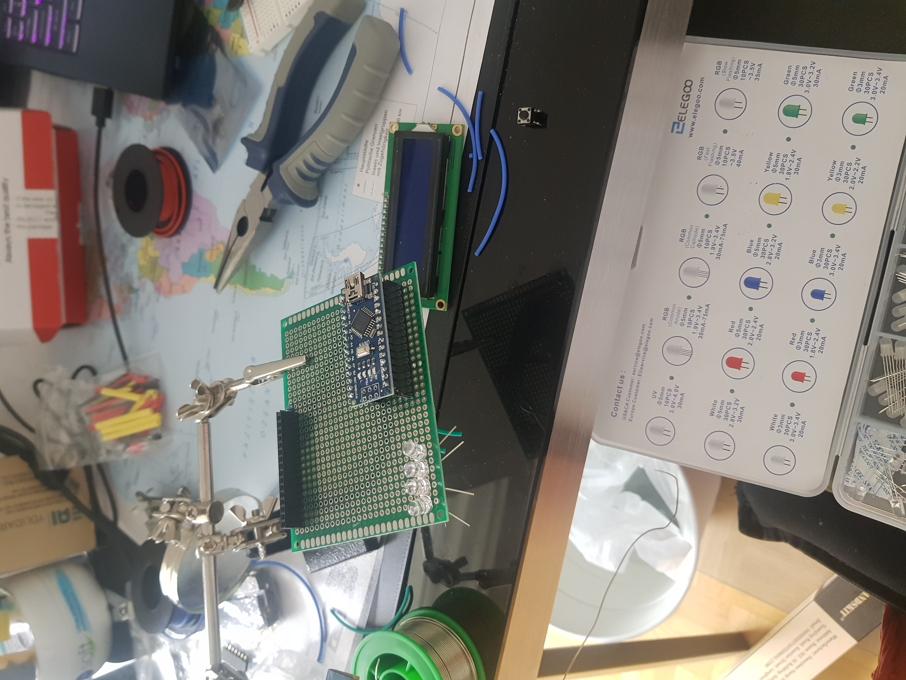

# prod_disaster_counter
This was a project I did for a friend who works in software. I thought it could be fun for them to visualize days without an incident, and maybe they can talk the boss into a pizza party when the days make it past milestones!  
  

You can find the code in the arduino_prod_disaster_counter subfolder. There's a submodule for the display, as well as for the disaster count logic, as well as for the button.  

I built this in an afternoon, and the wires got a bit messy. I'd like to get into PCBs in the future, and may revisit this and design a pcb for it.  
  

  

Some of the tricky stuff: for the LCD i didnt have a potentiometer to set the contrast, so i wired it to a digital pin and did analog write with a value of 10. You can read it, but its not so clear. If i were to do this again I would add a potentiometer, or try with an analog pin.  
