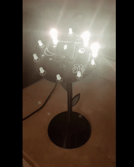
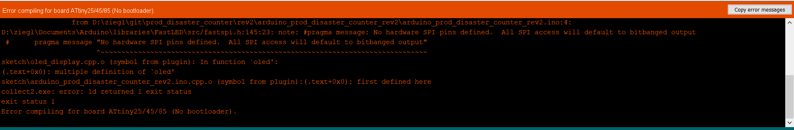
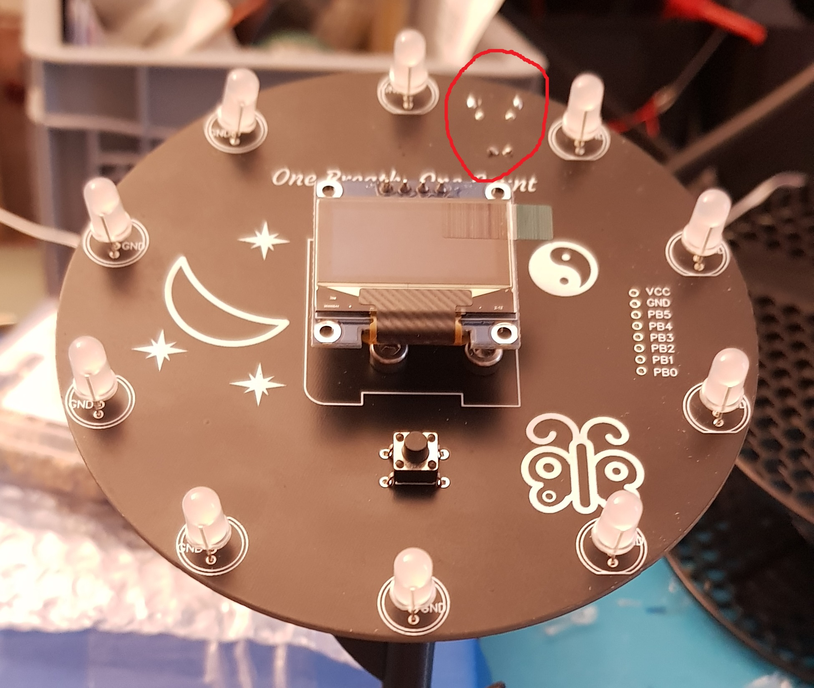
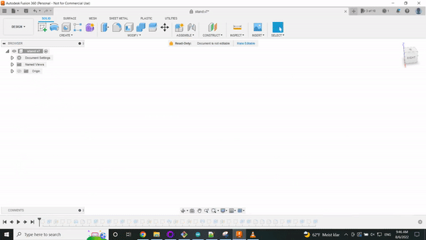

# prod_disaster_counter
This was a fun project to make a little device that can count things for people, like days in a row they've meditated, practiced a musical instrument, or gone for a walk. I made two versions of this. The first was hastily done on a prototyping board, the second was designed and manufactured to be prettier and more functional.

## Rev 2.0
You can see a video demo [here](https://www.youtube.com/watch?v=l-LTvP333-I). 

### Programming the Counter
#### Modularization
I tried to keep things modular, having one module for lights and one for screen stuff and so on...you can peruse the code in the rev2/arduino_prod_disaster_counter_rev2 folder.  

One trouble i ran into was that some libraries like the oled library i used didnt like being included in a header file. I saw a variable redefinition error. So I assume a variable was defined in the header and that caused trouble when i included the library from multiple places. I eventually solved this by putting the library include in the source, the .cpp file instead of the header.
  
This is an interesting point--lots of projects with Arduino have the code all in one source file. And, lots of libraries, including some i've written, assume this approach. When trying to share with other people, and modularize, one has to make sure to define variables only in source files, not in headers.  

#### Memory
One of the biggest things I struggled with was keeping the program size within the limits of my microcontroller-the ATTINY85. As the name implies, the ATTINY85 is tiny and doesn't have that much memory in terms of program storage space of dynamic memory--it has about 8kb program storage space. I was constantly running up against that limit when adding features like night mode and different animations for the screen and the lights...

Some of the libraries i'm using like FastLED take quite a bit of memory, and for my own code I tried to save space where i could by making variables static and keeping code simple. For the most part, I didnt have to cut any features, but towards the end to add the feature to save the days counter on power off and power on, i did have to cut down the flower spin animation on the screen to free up some program storage space. As I optimize the code further I hope to add that back in.

#### Animations
The Attiny isnt that powerful, but i used a library for the oled screen that supported double buffering, so i can write to the ram of the oled while its displaying another image. This helped me get smooth animations like the intro flower spin animation.  
   

### Desiging the PCB
This is the first PCB I've designed. I was fortunate to have a friend who does this often and professionally, and who made some recomendations and did some design review for me.  

#### Copper pours and Ground Planes
One of the advice starting out was for me to use ground planes where an entire part of the PCB is a copper pour and grounded. As signals run through it with power lines, this can keep the signal clean and also simplify connecting traces as all grounds are connected to the ground plane.  

As I found out later, this does make soldering trickier, especially if you are using lead-free solder with a higher melting temperature. The ground plane absorbs heat and this makes it very tricky to heat up large areas enough to solder.  

#### SMD Components
My friend also pushed me to use mostly surface mount device components, which I ended up really liking. They let me do a lot of the routing on the back of the PCB, keeping the front clean and looking nice. I did use a couple through hole components like a usb connector and an electrolytic capacitator, but these were minimal and all around each other. You can see in the picture the through hole components do mar the top, but they are small and tucked away:  

#### USB Component
I wanted to have a micro usb connector for power because i thought that would be really easy for users. That said, it complicated matters. My friend told me they tore off quite often, and i experienced that. I also found it really hard to solder it on the pcb with the ground plane....

#### What would I change?
I had a couple small problems with the pcb design, but luckily nothing that was a show stopper. That said, if I were to make more of these, I would do some stuff differently:  
* The usb port wasnt close enough to the edge of the pcb, so i had to use special micro usb cabels with longer connectors. Normal ones, their plastic caught on the edge of the pcb. Id move the usb connector all the way to the edge.  
* I didnt check what header ports I put on the board and their spacing. They ended up being smaller than standard arduino ones...I would probably standardize them.
* Some of the oled screens i stock have vcc and ground flipped from the others. I had enough of the ones I designed for, but I didnt realize this wasnt standardized and so wasnt able to use as many oled screens as I wanted.
* The leds didnt push down to sit flush on the pcb board. I think was because I designed the holes too big and too far apart.

### Assembling the PCB
There was a lot of hand soldering, but I reallly had a ton of trouble with the ground plane and the usb connector. Im still working out a better way to do that.

### CAD and 3d Printing

#### Threaded Inserts
I normally use a captive nutt to secure 3d printed parts to each other, but a friend of mine had been using threaded inserts and recommended it, so I tried them out. They worked great. It was a bit of trial and error to see good hole sizes and lengths for my inserts, but in the end I was quite happy.  

#### Tipping Concerns
I was a bit worried that the whole flower would tip over. To remedy this I made the bottom big and heavy, and the top light.

#### Print Settings
I printed the base at 80% infill, as I wanted it to be heavy. The flower part I printed at 20% infill, with a brim to help with bed adhesion.

### Useful Links

See a guide on how to unlock the digikey spark Rev 3.0 [here](https://www.instructables.com/How-to-unlock-Digispark-ATtiny85-and-convert-it-to/). They list another guide with an example sketch they use [here](http://www.rickety.us/2010/03/arduino-avr-high-voltage-serial-programmer/). 

I did the high voltage programming example with a PC817 Octoupler.

Then I had to install this core for the attiny85. I used AtTiny core from SpenceKonde [here](https://github.com/SpenceKonde/ATTinyCore/). Then the ISP example first flashing bootloader at 8mhz to set the fuses.

Used 4k oled [here](https://github.com/datacute/Tiny4kOLED), and this i2c [here](https://github.com/technoblogy/tiny-i2c).

Interesting thread on memory usage of FastLED vs Adafruit_Neopixel: https://forum.arduino.cc/t/binary-very-large-when-using-fastled/568866/10

## Rev 1.0
This was a project I did for a friend who works in software. I thought it could be fun for them to visualize days without an incident, and maybe they can talk the boss into a pizza party when the days make it past milestones! You can find a video demo [here](https://www.youtube.com/shorts/DNOm6Y0vupc).  
  

You can find the code in the arduino_prod_disaster_counter subfolder. There's a submodule for the display, as well as for the disaster count logic, as well as for the button.  

I built this in an afternoon, and the wires got a bit messy. I'd like to get into PCBs in the future, and may revisit this and design a pcb for it.  
  

  

Some of the tricky stuff: for the LCD i didnt have a potentiometer to set the contrast, so i wired it to a digital pin and did analog write with a value of 10. You can read it, but its not so clear. If i were to do this again I would add a potentiometer, or try with an analog pin.  
